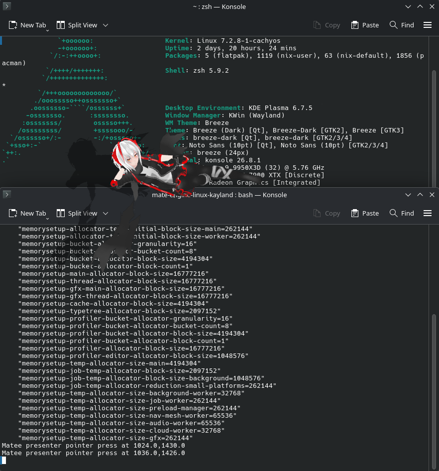

# Mate Engine: Native Wayland Fork

A desktop companion for **KDE Plasma 6 on native Wayland**, with transparent
avatars, custom VRM models, and window sitting.

This fork builds on [Mate-Engine-Linux-Port](https://github.com/Marksonthegamer/Mate-Engine-Linux-Port),
the unofficial Linux port of [Mate Engine](https://github.com/shinyflvre/Mate-Engine).
Its focus is native Wayland integration with KDE's KWin compositor.



*Window sitting on KDE Plasma 6 with KWin running Wayland.*

## Known issues: read before installing

> [!WARNING]
> **The startup logo and splash screen are very buggy and visually broken.**
> A fix is unlikely anytime soon. Expect this rough edge during startup, even
> though normal desktop companion behavior is working.

- **Mods do not load correctly.**
- **Avatar controls depend on model naming and structure.** Automatic detection
  can be wrong; use Setup to rename or recategorize controls. Material and spring
  physics entries are read-only inventories, not editors.

## What works

- Transparent avatars with click-through outside their visible shape.
- Dragging, scrolling to resize, monitor-relative startup placement, and topmost
  control.
- Window and panel detection, sitting, and movement along window edges.
- Multi monitor setup with 3 different aspect ratios confirmed working in KDE6
- Custom VRM0 and VRM1 importing, automatic avatar controls, and saved presets.
- Presenter failure recovery: the Unity source window returns if the presenter
  stops.

Existing Mate Engine features include alarms, screensaver and Chibi modes,
mouse tracking, custom dances, event messages, localization, Discord RPC, and
optional AI chat. Dancing is experimental and uses PulseAudio or PipeWire's
PulseAudio compatibility service for audio application detection.

## Features added by this fork

- **Native KDE Wayland integration:** A transparent presenter provides
  click-through, pointer and keyboard input, dragging across monitors, scaling,
  and recovery if the presenter stops. KWin integration handles placement,
  topmost state, and desktop window geometry.
- **Window and panel sitting:** The avatar detects exposed top edges, sits on
  them, follows its supporting window, and detaches when the target is no longer
  eligible. Covered parts of a seated avatar are hidden and click-through.
- **Automatic avatar controls:** A custom scanner discovers controls from a
  loaded model and exposes them through the Clothes menu, including models
  without authored Mate Engine clothing entries.
- **Per-avatar setup and presets:** Rename, categorize, hide, and group controls,
  save presets, and restore imported defaults without modifying the model file.
- **Avatar library cleanup:** Loading the library removes entries for missing
  files or invalid paths while retaining model files and thumbnails.
- **Pinned builds and portable export:** The Nix environment pins the Unity
  Editor and native tooling; the exporter bundles the presenter's Qt runtime.

### How automatic model detection works

After a model loads, the fork's
[`AvatarControlScanner`](Assets/MATE%20ENGINE%20-%20Scripts/AvatarControls/AvatarControls.cs)
inspects its mesh renderers, blendshapes, VRM0/VRM1 expressions, and existing
`MEClothes` entries. It reads available VRM title, author, and version metadata.
Authored clothing entries retain their own controls; other meshes and morphs
receive controls discovered from the model's contents.

Name-based rules organize clothing, accessories, body morphs, and facial controls.
Matching normalized morph names on body and clothing meshes are linked so one
slider can adjust both. Recognized clothing correction morphs can follow an
outfit's visibility. This detection depends on model structure and naming;
unrecognized meshes appear under Uncategorized, and raw controls are available
in Advanced. Setup lets you correct the organization manually.

Saved profiles are matched first by the model file's SHA-256 hash, then by a
signature derived from its metadata and discovered structure. This allows a
renamed or moved file to retain its settings. Ambiguous matches use defaults
until a profile is selected. Profiles live in Unity's per-user `AvatarProfiles`
directory, outside the model file.

## Supported desktop

| Environment | Status |
| --- | --- |
| KDE Plasma 6 / KWin, native Wayland | Supported target |
| Other Wayland compositors | Unsupported; desktop integration currently depends on KWin backend, don't expect it to even render, |
| X11 / XWayland | Outside this fork's scope; use the source project for x11, this fork is for specifically wayland support |

The development baseline uses Arch Linux and Unity `6000.2.6f2`. Earlier
functional checks used a VM with KWin 6.7.5 and software rendering; those checks
are separate from the confirmed KDE6 multi-monitor setup. Support does not imply
that every GPU, monitor layout, or distribution has been tested.

## Download v0.1

The `v0.1` release contains the source snapshot and the x86-64 Linux AppImage.
Download the AppImage from [Releases](https://github.com/PoonHarpoon/mate-engine-linux-kayland/releases/tag/v0.1),
make it executable, and run it from a KDE Plasma 6 Wayland session:

```sh
chmod +x MateEngine-Linux-Wayland-v0.1-x86_64.AppImage
./MateEngine-Linux-Wayland-v0.1-x86_64.AppImage -force-glcore
```

The package includes CPU-selected implementations and is not AVX-512-only.
It still requires compatible host libraries, graphics drivers, and FUSE support.
See the release notes for tested scope and runtime requirements.

## Build and run

You need KDE Plasma 6 in a Wayland session, KWin layer-shell support, and
Determinate Nix with flakes enabled. The pinned development environment supplies
Unity `6000.2.6f2` and the native build dependencies. Unity license activation
requires your own Unity account and remains outside the reproducible build.

If you need to activate a license, launch Unity Hub:

```sh
nix run .#unityhub
```

Then, from the repository root:

```sh
nix develop
./build.sh ./Build
cd Build
env -u DISPLAY ./launch.sh
```

The first setup downloads about 4.1 GiB for the Editor plus runtime dependencies.
The first import and build can take several minutes. Keep the ignored `Library/`
directory to reuse Unity's asset and shader caches.

The build compiles the `StandaloneFileBrowser` native plugin from source, builds
the Unity player, and packages the native Wayland presenter. Use `launch.sh` to
start the player: it selects native Wayland and starts the presenter. Confirm
`Selected window backend: wayland` in the Unity player log.

Source-project packages do not contain this fork's native Wayland integration.
See [usage.md](usage.md) for build options, Editor launch, runtime requirements,
and troubleshooting.

### Portable export

For a portable player, build the file-browser plugin against the destination
loader and host GTK libraries, then export into a new directory:

```sh
MATEENGINE_PORTABLE_PLUGIN=1 ./build.sh ./Build
nix run .#export-portable -- ./Build ./MateEngine-portable
```

The destination must not already exist. The exported directory bundles the
presenter's Qt runtime and is intended to run without Nix on the destination.
It still needs compatible x86-64 Linux host libraries, graphics drivers, KDE
Wayland, and AppImage runtime support. Test it on the target machine before
sharing it. See [portable export instructions](usage.md#build-a-player).

## Using your companion

| Action | Control |
| --- | --- |
| Open the radial menu | Right-click the avatar |
| Move the avatar | Left-click and drag |
| Change avatar size | Scroll over the avatar |
| Sit on a window or panel | Enable window sitting, hold a drag for at least one second, and cross an exposed top edge with the avatar's hips |
| Adjust an imported avatar | Open Clothes to access Avatar Controls |
| Lifecycle and window actions | Use the tray menu |

Imported VRM avatars expose discovered clothing, body morphs, expressions, and
face morphs. Linked body and clothing morphs adjust together. Advanced shows raw
controls and material/physics inventories; Setup lets you organize controls, and
presets save combinations. Keyboard input is available while Avatar Controls is
open, with the `ABC` on-screen keyboard as a fallback.

Profiles are saved under `AvatarProfiles` in Unity's per-user data directory;
model files are not modified. Reset restores imported defaults. Existing `.me`
clothing keeps its authored behavior.

Opening or reloading the avatar library removes entries whose source files are
missing or whose paths are invalid. It does not delete model files or thumbnails.
Models on disconnected storage must be reimported after reconnecting it.

Optional AI chat requires your own `llama-3.2-3b-instruct-q4_k_m.gguf` beside the
player executable. Model weights and local test avatars are not distributed with
this fork.

## Development and bug reports

Unity renders the avatar; a separate native Wayland presenter displays its RGBA
frames and forwards input. KWin integration supplies desktop geometry and window
operations. Technical details live in the [presenter documentation](Native/WaylandPresenter/README.md)
and [sitting validation guide](Native/WaylandPresenter/VALIDATION.md).

For a bug report, include reproduction steps, the revision and launch command,
Plasma/KWin version, graphics API and renderer, monitor layout and scales, and
relevant Unity/presenter log lines. Record `XDG_SESSION_TYPE`, whether
`WAYLAND_DISPLAY` and `DISPLAY` are set, and the observed Unity backend. Review
logs for personal information before sharing them.

## License

This fork retains the upstream **MateEngine Pro License (v2.0)**. See
[LICENSE](LICENSE) for its terms, including the separate asset terms. Bundled
third-party components retain their own licenses and notices in
[Third Party Licenses](Third%20Party%20Licenses/).
